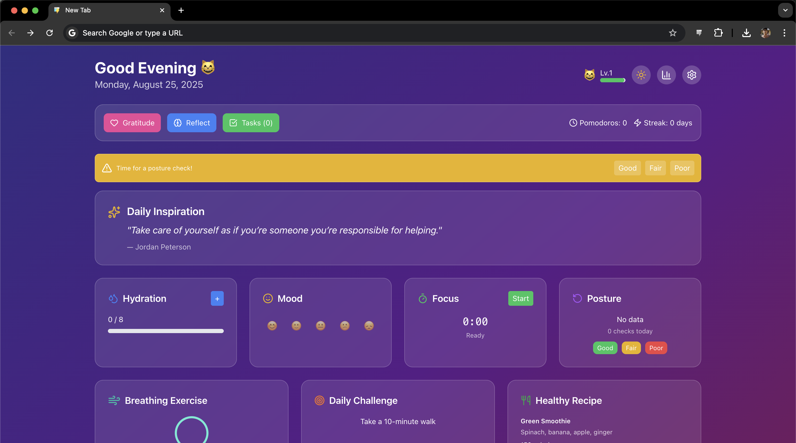
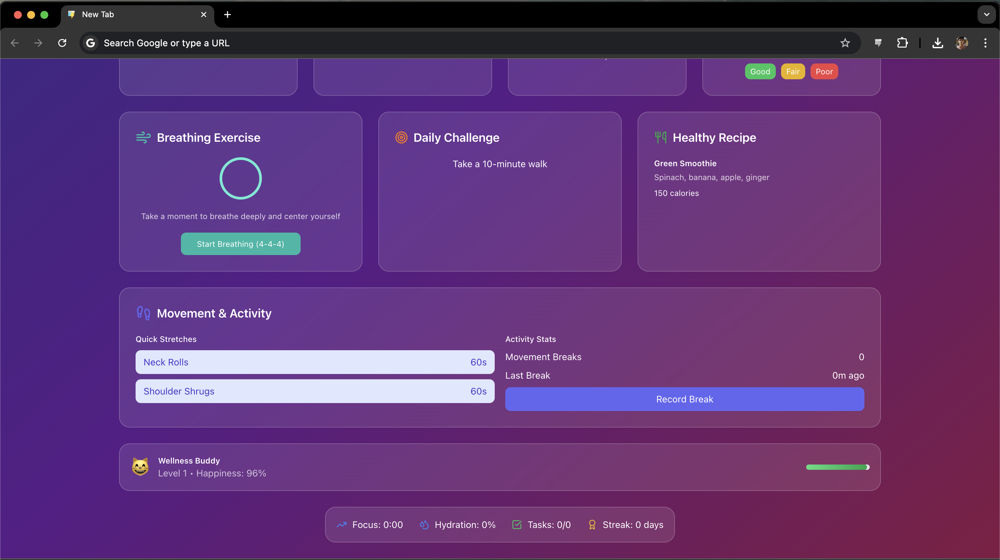

# Productivity & Wellness Chrome Extension

A Chrome extension designed to boost your productivity and improve wellness, all in one place. It helps you track hydration, mood, screen time, tasks, focus sessions, and even includes healthy recipe suggestions.

> **Note:** This project is still in the **development phase**. Expect frequent updates and improvements. Feedback and suggestions are highly appreciated!

---

## Demo

---

## Features

* **Focus Timer** – Stay productive with built-in pomodoro-style focus sessions.
* **Mood & Wellness Tracking** – Log mood, hydration, and breathing exercises.
* **Daily Challenges** – Simple wellness goals (e.g., drink 8 glasses of water).
* **Healthy Recipes** – Quick and healthy snack ideas.
* **Screen Time Insights** – Get an overview of your online time.

---

## Installation

### Quick Install with Pre-Built ZIP

1. [Download **dist.zip**](./dist.zip)
3. Extract the zip file.
4. Open Chrome and go to `chrome://extensions/`.
5. Enable **Developer Mode** (toggle in the top-right).
6. Click **Load unpacked**.
7. Select the extracted **dist** folder.
8. Done! The extension is now ready to use.

## Usage

* Open a new Chrome tab to view your dashboard.
* Track your tasks, focus sessions, hydration, and mood.
* Customize settings from the extension options.
* Dark/Light mode according to time. (you can change)
  
---

## Roadmap / To-Do

* [ ] Calendar and reminders integration
* [ ] Analytics dashboard
* [ ] More widgets and gamification

---

## Feedback & Contributions

This extension is actively being built. **Your feedback matters!**

* Found a bug? Open an [issue](https://github.com/<your-username>/<repo-name>/issues).
* Have an idea? Start a discussion or submit a pull request.

---